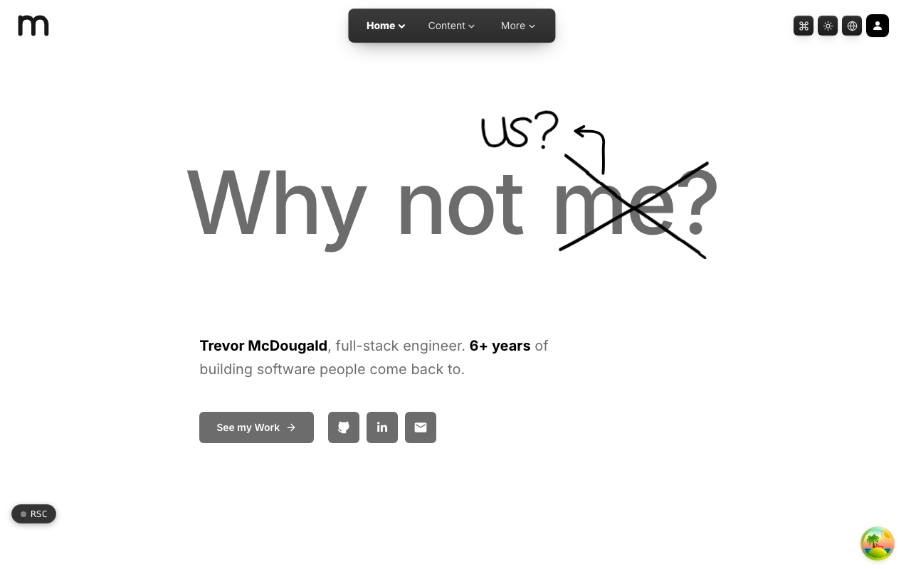

  <picture>
    <source media="(prefers-color-scheme: dark)" srcset=".github/assets/hero-dark.png">
    
  </picture>

# me.at

Trevor McDougald, full-stack engineer. 6+ years of building software people come back to.

me.at is my portfolio home page and the front door of the `*.me.at` family of apps. It is one long landing page: who I am, where I have worked, what I have built, what people I have worked with say, my latest writing, and a directory of every public sibling site in the network. Long-form writing lives on read.me.at, and project cards link there.

**Live:** [me.at](https://me.at)

## Features

- **Landing page**: a hero, About Me, a work experience timeline, projects, testimonials and references, and recently updated posts, with sections below the fold lazily hydrated behind skeletons.
- **Network directory**: every public `*.me.at` site, grouped into sites, content and tools, built from the family's shared registry rather than a hand-kept list.
- **Newsletter signup**: double opt-in capture with confirmation tokens and rate limiting.
- **Embeddable profile card**: a `/card.svg` image with a ready-to-paste HTML snippet.
- **Feeds and text files**: RSS, `llms.txt` and `humans.txt`.
- **Shared accounts**: email and password sign-in, account and password-reset pages shared with the rest of the family.
- **Light and dark themes, multiple languages**: theme and locale switchers in the shared header.

## Built with

- Next.js 16 (App Router), React 19, TypeScript
- Tailwind CSS 4
- Motion and GSAP for animation
- Better Auth
- Drizzle ORM + Postgres
- Resend for newsletter email
- PostHog analytics (consent-gated), deployed on Vercel

## The me.at family

me.at is the hub of the `*.me.at` network: a family of small sites and products by Trevor McDougald, each on its own subdomain, most named so the address reads as a sentence ("read me at", "find me at", "hire me at"). They share one design system, one account, and one app shell (header, footer, auth, locales and legal pages), and they are built in a single private monorepo. Apps get a public-facing GitHub repository that carries their README and screenshots.

Some public members of the family:

| Domain | What it is |
| --- | --- |
| [read.me.at](https://github.com/mcdougald/read.me.at) | Writing, notes and project write-ups: the long-form home for the blog. |
| [find.me.at](https://github.com/mcdougald/find.me.at) | Every place to find me online, in one link hub. |
| [use.me.at](https://github.com/mcdougald/use.me.at) | The hardware, editor and software I use day to day. |
| `about.me.at` | Background, skills and the path so far. |
| `beat.me.at` | A free solo browser arcade of hand-built games with a public leaderboard. |
| `try.me.at` | Interactive in-browser demos of portfolio projects. |
| `ping.me.at` | Status pages that only report what they saw, including the network's own board. |
| `trust.me.at` | One-time secrets, encrypted in your browser, that self-destruct after one view. |
| `domain.me.at` | Domain portfolio tracking: expiry reminders and DNS and TLS change detection. |
| `design.me.at` | Versioned design tokens, published as CSS variables, a Tailwind theme or DTCG JSON. |
| `hire.me.at` | Career ops for job seekers: an application pipeline and a resume studio. |
| `protect.me.at` | The privacy policy and terms every app in the network points at. |
| `lost.me.at` | Find every live domain and resolve short or moved links. |

## License

See [LICENSE](LICENSE).
